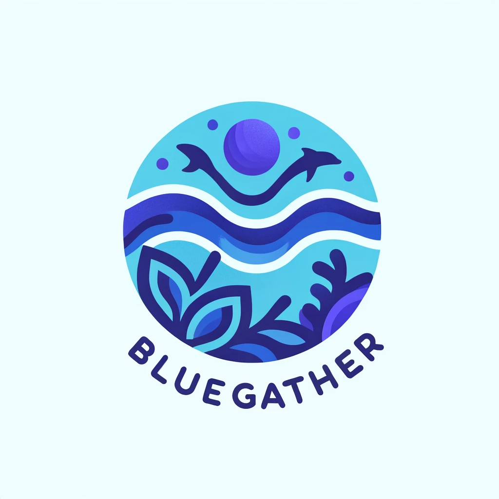

# BlueGather

 

  

## Apresentação da Equipe

### Integrantes:
- RM 97068 - Gustavo Sorrilha Sanches
- RM 96466 - Kaue Caponero Figueiredo
- RM 97503 - Mariana Santos Fernandes de Sousa
- RM 97324 - Natan Cruz
- RM 97092 - Vitor Rubim Passos

## Justificativa
Os oceanos enfrentam desafios significativos, desde a destruição de habitats marinhos até a poluição e as mudanças climáticas. Esses problemas afetam não apenas os ecossistemas marinhos, mas também têm impacto direto na economia global. Diante disso, é crucial encontrar soluções tecnológicas sustentáveis que promovam a preservação dos oceanos e de sua biodiversidade.

## Objetivo
O objetivo do GreenGather é engajar a comunidade em ações sociais que promovam a limpeza e a conservação dos oceanos. Através de um aplicativo móvel, os usuários podem criar e participar de eventos como limpeza de praias, resgate de animais marinhos, etc.. contribuindo ativamente para um ambiente marinho mais saudável.

## Público Alvo
Nosso público alvo são:
- Cidadãos conscientes e preocupados com o meio ambiente
- Organizações não governamentais e instituições voltadas para a preservação ambiental
- Empresas que desejam engajar seus funcionários em atividades de responsabilidade social corporativa

## Arquitetura da Solução

### Frontend Mobile
- Desenvolvido em React.

### Backend
- Implementado em Java com Spring Boot para a API RESTful.
- Implementado também em C# com .NET para a API RESTful.

### Banco de Dados
- Utilização do banco de dados Oracle para armazenar informações.

### Plataforma de DevOps
- Implementação de CI/CD usando a plataforma Azure DevOps, garantindo a entrega contínua e a integração de novas funcionalidades de forma automatizada e segura.

## Funcionalidades do Aplicativo
- Cadastro de usuários
- Criação e visualização de eventos em um mapa interativo
- Adição de fotos e descrições detalhadas dos eventos
- Participação em eventos como voluntário
- Avaliação do evento
